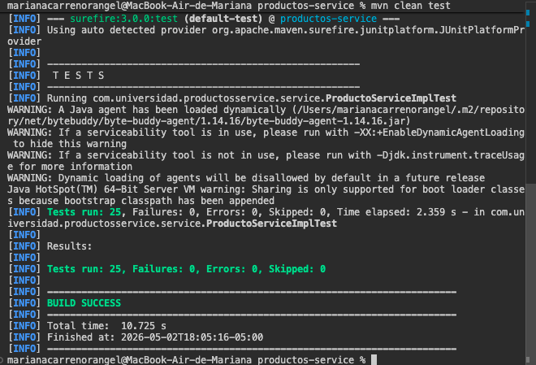

# Proyecto: Productos Service - Pruebas Unitarias con JUnit 5 y Mockito

## 📋 Descripción

Suite completa de pruebas unitarias para un microservicio de gestión de productos implementado en **Spring Boot 3.3.0** con **Java 21**. El proyecto demuestra el uso de **JUnit 5**, **Mockito** y técnicas avanzadas de testing como **@Mock**, **@InjectMocks**, **@ParameterizedTest**, y **ArgumentCaptor**.

## 🎯 Objetivo

El estudiante implementa una suite completa de pruebas unitarias para los componentes de servicio de una aplicación Spring Boot, aplicando:
- JUnit 5 y Mockito para aislar la lógica de negocio de sus dependencias
- Verificación de comportamientos con assertions específicas
- Cobertura de escenarios de error y casos límite con pruebas parametrizadas
- Captura de argumentos para validar transformaciones de datos

## 🏗️ Arquitectura del Proyecto

```
productos-service/
├── src/
│   ├── main/
│   │   ├── java/com/universidad/productosservice/
│   │   │   ├── ProductosServiceApplication.java        ← Main
│   │   │   ├── domain/
│   │   │   │   └── Producto.java                       ← Entidad JPA
│   │   │   ├── repository/
│   │   │   │   └── ProductoRepository.java             ← JpaRepository
│   │   │   ├── service/
│   │   │   │   ├── ProductoService.java                ← Interfaz
│   │   │   │   └── ProductoServiceImpl.java             ← Implementación
│   │   │   └── controller/
│   │   │       └── ProductoController.java             ← REST Controller
│   │   └── resources/
│   │       └── application.properties                  ← Configuración
│   └── test/
│       └── java/com/universidad/productosservice/
│           └── service/
│               └── ProductoServiceImplTest.java         ← Suite de Pruebas
├── pom.xml                                              ← Dependencias Maven
├── .gitignore
└── README.md

```

## 🔧 Dependencias Principales

- **Spring Boot**: 3.3.0 (Web, Data JPA)
- **JUnit 5 (Jupiter)**: Incluido en `spring-boot-starter-test`
- **Mockito**: 5.x (Incluido en `spring-boot-starter-test`)
- **H2 Database**: Base de datos embebida para testing
- **Lombok**: Para reducir código boilerplate en la entidad
- **Maven**: 3.9+

## 📝 Entidad Principal: Producto

```java
@Entity
@Table(name = "productos")
public class Producto {
    @Id
    @GeneratedValue(strategy = GenerationType.IDENTITY)
    private Long id;
    
    @Column(nullable = false)
    private String nombre;
    
    @Column(nullable = false)
    private Double precio;
    
    @Column(nullable = false)
    private Integer stock;
}
```

## 🧪 Suite de Pruebas Unitarias

### **Paso 3: Casos Exitosos (@Mock, @InjectMocks)**

1. **crear_datosValidos_retornaProductoGuardado()**
   - Verifica que el servicio crea un producto correctamente
   - Mock del repositorio devuelve un producto guardado
   - Validación de campos y verificación de llamadas

2. **buscarPorId_existente_retornaProducto()**
   - Busca un producto existente por ID
   - Mock devuelve Optional con el producto

3. **actualizarStock_productoExistente_actualizaCorrectamente()**
   - Actualiza el stock de un producto
   - Verifica que save() es llamado con los datos correctos

### **Paso 4: Pruebas de Error (@ParameterizedTest)**

4. **buscarPorId_noExistente_lanzaRuntimeException()**
   - Verifica que se lanza RuntimeException cuando el producto no existe

5. **crear_nombreInvalido_lanzaIllegalArgumentException()**
   - Parametrizadas con @NullAndEmptySource y @ValueSource
   - Cubre: null, vacío, espacios en blanco
   - Verifica que el repositorio NO es llamado

6. **crear_precioInvalido_lanzaIllegalArgumentException()**
   - Valores: 0.0, -1.0, -100.0, -0.01
   - Verifica validación de precio > 0

7. **crear_stockNegativo_lanzaIllegalArgumentException()**
   - Valores: -1, -10, -100
   - Verifica que stock no puede ser negativo

8. **actualizarStock_stockNegativo_lanzaIllegalArgumentException()**
   - Valida stock negativo en actualización

9. **eliminar_productoNoExistente_lanzaRuntimeException()**
   - Verifica excepción al eliminar producto inexistente

### **Paso 5: ArgumentCaptor y Verificación Avanzada**

10. **crear_nombreConEspacios_guardaNombreNormalizado()**
    - Captura el objeto Producto pasado a save()
    - Verifica que espacios en blanco se eliminan con strip()
    - ArgumentCaptor permite inspeccionar datos exactos

11. **crear_precioConDecimales_guardaPrecioExacto()**
    - Verifica precisión de decimales (99.99)

12. **eliminar_productoExistente_llamaDeleteById()**
    - Verifica que findById() y deleteById() son llamados exactamente una vez

13. **buscarPorId_llavaRepositorioExactamenteLaVez()**
    - Usa verifyNoMoreInteractions() para validar interacciones exactas

14. **actualizarStock_verificaQueSeGuardaCon_save()**
    - Captura el producto actualizado
    - Verifica valores correctos antes de persistir

## Evidencia de Ejecucion

### Captura: `mvn test` con `BUILD SUCCESS`




